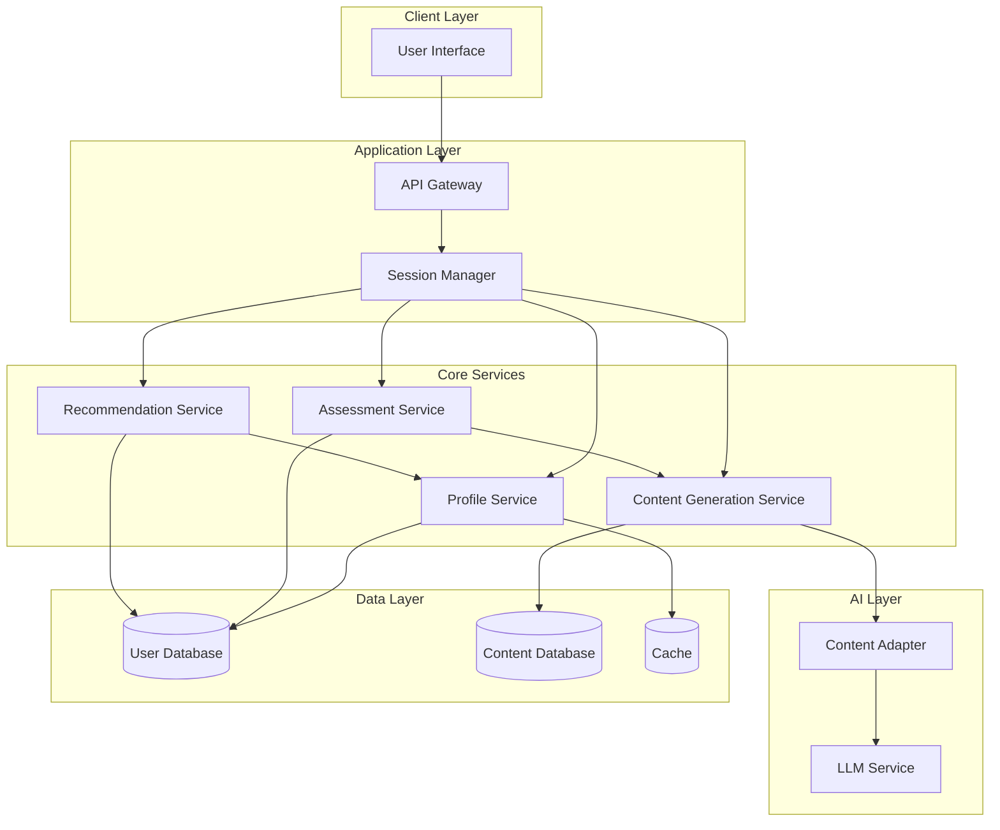

# Design Document: Adaptive Learning Assistant

## Overview

The Adaptive Learning Assistant is built as a modular system with clear separation between user interaction, content generation, assessment, and data persistence layers. The architecture enables independent scaling of AI-powered content generation while maintaining responsive user interactions and reliable data storage.

The system follows a service-oriented architecture where each major capability (explanation generation, practice task creation, confusion detection, skill recommendation) is encapsulated in dedicated components that communicate through well-defined interfaces.

## Architecture

### High-Level System Architecture



### Architecture Layers

**Client Layer**
- Web-based user interface for learner interactions
- Handles user input, displays content, and provides feedback
- Communicates with backend via REST API

**Application Layer**
- API Gateway: Routes requests and handles authentication
- Session Manager: Maintains user session state and coordinates service calls

**Core Services Layer**
- Profile Service: Manages user profiles, skill levels, and learning history
- Content Generation Service: Creates adaptive explanations and practice tasks
- Assessment Service: Evaluates user performance and detects confusion
- Recommendation Service: Generates next-step learning suggestions

**AI Layer**
- LLM Service: Interfaces with external AI/LLM provider
- Content Adapter: Transforms LLM outputs to match skill level requirements

**Data Layer**
- User Database: Persistent storage for profiles and progress
- Content Database: Stores generated content and concept definitions
- Cache: Improves performance for frequently accessed data

## Components and Interfaces

### 1. Profile Service

**Responsibilities:**
- Create and retrieve user profiles
- Update skill levels and performance metrics
- Track learning history and completed concepts

**Interface:**
```typescript
interface ProfileService {
  createProfile(userId: string): UserProfile
  getProfile(userId: string): UserProfile
  updateSkillLevel(userId: string, concept: string, newLevel: SkillLevel): void
  recordPerformance(userId: string, taskId: string, performance: Performance): void
  getCompletedConcepts(userId: string): Concept[]
}
```

**Key Operations:**
- Profile initialization with default beginner level
- Atomic updates to prevent race conditions
- Historical performance tracking for trend analysis

### 2. Content Generation Service

**Responsibilities:**
- Generate explanations adapted to skill level
- Create practice tasks matching user capabilities
- Provide hints for practice tasks

**Interface:**
```typescript
interface ContentGenerationService {
  generateExplanation(concept: Concept, skillLevel: SkillLevel): Explanation
  generatePracticeTask(concept: Concept, skillLevel: SkillLevel): PracticeTask
  generateHint(task: PracticeTask, attemptHistory: Attempt[]): Hint
  regenerateWithAlternativeApproach(concept: Concept, skillLevel: SkillLevel, previousApproach: string): Explanation
}
```

**Key Operations:**
- Skill-level-specific content templates
- Dynamic difficulty adjustment
- Alternative explanation strategies for confusion recovery

### 3. Assessment Service

**Responsibilities:**
- Evaluate user responses to practice tasks
- Detect confusion signals
- Determine skill level adjustments

**Interface:**
```typescript
interface AssessmentService {
  evaluateResponse(task: PracticeTask, response: string): EvaluationResult
  detectConfusion(userId: string, concept: Concept): ConfusionLevel
  shouldAdjustSkillLevel(userId: string, concept: Concept): SkillLevelAdjustment
  recordConfusionSignal(userId: string, concept: Concept, signal: ConfusionSignal): void
}
```

**Key Operations:**
- Multi-factor confusion detection (accuracy, time, hints)
- Threshold-based skill level adjustment
- Performance trend analysis

### 4. Recommendation Service

**Responsibilities:**
- Generate next-step learning recommendations
- Identify prerequisite gaps
- Prioritize learning paths

**Interface:**
```typescript
interface RecommendationService {
  getRecommendations(userId: string, count: number): SkillRecommendation[]
  checkPrerequisites(userId: string, concept: Concept): PrerequisiteCheck
  prioritizeByRecency(userId: string, recommendations: SkillRecommendation[]): SkillRecommendation[]
}
```

**Key Operations:**
- Dependency graph traversal for prerequisites
- Recency-based prioritization
- Personalized learning path generation

### 5. Content Adapter

**Responsibilities:**
- Transform LLM outputs to match skill level requirements
- Apply content templates and formatting
- Ensure consistency in tone and complexity

**Interface:**
```typescript
interface ContentAdapter {
  adaptExplanation(rawContent: string, skillLevel: SkillLevel): Explanation
  adaptPracticeTask(rawContent: string, skillLevel: SkillLevel): PracticeTask
  validateComplexity(content: string, targetLevel: SkillLevel): boolean
}
```

**Key Operations:**
- Complexity scoring and validation
- Template-based content structuring
- Skill-level-specific vocabulary filtering

## Data Models

### UserProfile
```typescript
interface UserProfile {
  userId: string
  createdAt: Date
  skillLevels: Map<string, SkillLevel>  // concept -> skill level
  performanceHistory: Performance[]
  completedConcepts: string[]
  confusionHistory: ConfusionRecord[]
  effectiveApproaches: Map<string, string[]>  // concept -> successful explanation types
}
```

### SkillLevel
```typescript
enum SkillLevel {
  BEGINNER = "beginner",
  INTERMEDIATE = "intermediate",
  ADVANCED = "advanced"
}
```

### Concept
```typescript
interface Concept {
  id: string
  name: string
  domain: string
  prerequisites: string[]  // concept IDs
  description: string
}
```

### Explanation
```typescript
interface Explanation {
  conceptId: string
  skillLevel: SkillLevel
  content: string
  examples: Example[]
  approach: string  // e.g., "analogy", "step-by-step", "technical"
  generatedAt: Date
}
```

### PracticeTask
```typescript
interface PracticeTask {
  id: string
  conceptId: string
  skillLevel: SkillLevel
  description: string
  expectedAnswer: string
  hints: Hint[]
  difficulty: number  // 1-10 scale
  estimatedTime: number  // seconds
}
```

### Performance
```typescript
interface Performance {
  userId: string
  taskId: string
  conceptId: string
  correct: boolean
  timeSpent: number  // seconds
  hintsUsed: number
  attempt: number
  timestamp: Date
}
```

### ConfusionSignal
```typescript
interface ConfusionSignal {
  type: "incorrect_answer" | "multiple_hints" | "extended_time"
  severity: number  // 1-10 scale
  timestamp: Date
}
```

### ConfusionRecord
```typescript
interface ConfusionRecord {
  userId: string
  conceptId: string
  signals: ConfusionSignal[]
  resolved: boolean
  resolutionStrategy: string | null
}
```

### SkillRecommendation
```typescript
interface SkillRecommendation {
  concept: Concept
  reason: string
  priority: number
  prerequisitesMet: boolean
  estimatedDifficulty: number
}
```

### EvaluationResult
```typescript
interface EvaluationResult {
  correct: boolean
  feedback: string
  detailedExplanation: string
  suggestedNextStep: string
}
```

### SkillLevelAdjustment
```typescript
interface SkillLevelAdjustment {
  shouldAdjust: boolean
  direction: "increase" | "decrease" | "none"
  reason: string
  confidence: number  // 0-1 scale
}
```
